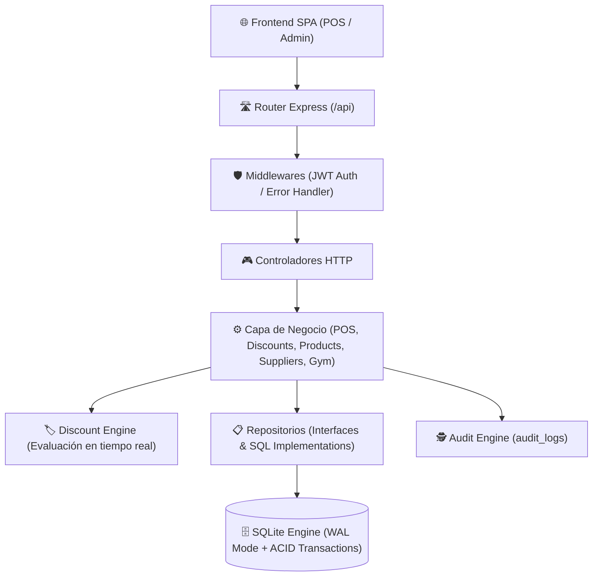
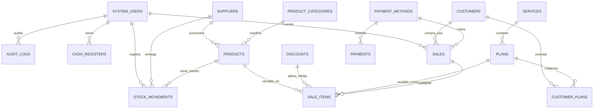

# 🏋️ Gym Management & POS System (Backend & Frontend SPA)

Sistema integral, modular y de alto rendimiento para la gestión administrativa, suscripciones, **Punto de Venta (POS)**, control de inventario de productos (aguas, batidos nutritivos, suplementos), proveedores y **motor de promociones y descuentos dinámicos** (por volumen y por tiempo).

Desarrollado con **TypeScript**, **Node.js**, **Express**, **SQLite (WAL Mode + Transacciones Atómicas)** y una interfaz SPA moderna en JavaScript Vanilla con diseño oscuro estilo Apple.

---

## 📑 Tabla de Contenidos

- [✨ Características Principales](#-características-principales)
- [🏛️ Arquitectura Modular del Sistema](#️-arquitectura-modular-del-sistema)
- [🗄️ Modelo de Base de Datos (Diagrama ER)](#️-modelo-de-base-de-datos-diagrama-er)
- [🛒 Módulo POS, Productos y Motor de Descuentos](#-módulo-pos-productos-y-motor-de-descuentos)
- [📂 Estructura de Directorios](#-estructura-de-directorios)
- [⚙️ Requisitos Previos e Instalación](#️-requisitos-previos-e-instalación)
- [🚀 Guía de Ejecución y Scripts](#-guía-de-ejecución-y-scripts)
- [📡 Manual Técnico y Referencia de la API REST](#-manual-técnico-y-referencia-de-la-api-rest)
- [🔐 Seguridad, Auditoría y Manejo de Errores](#-seguridad-auditoría-y-manejo-de-errores)
- [⚙️ Variables de Entorno](#️-variables-de-entorno)

---

## ✨ Características Principales

1. **🏋️ Gestión de Gimnasio**:
   - Servicios y disciplinas deportivas.
   - Planes mensuales y diarios por N cantidad de horas con validación de horarios y solapamientos.
   - Catálogo de uniformes / inscripciones.
   - Clientes y suscripciones con pagos parciales y cálculo automático de saldos.

2. **🛒 Punto de Venta (POS) en Vivo**:
   - Catálogo visual reactivo para venta rápida de productos físicos y planes.
   - Búsqueda por nombre y soporte para lector de código de barras / SKU.
   - Carrito de compras con cálculo en tiempo real de subtotales, descuentos y total.
   - Arqueo y cálculo automático de cambio / vuelto en efectivo.
   - Emisión y anulación transaccional de tickets de venta con restitución automática de stock.

3. **🥤 Catálogo de Productos y Kardex de Inventario**:
   - Gestión de productos (bebidas, batidos nutritivos preparados, suplementos, snacks, indumentaria).
   - Control de stock actual y alertas de stock mínimo.
   - Precios de costo y margen de ganancia.
   - Registro de entradas de mercadería desde proveedores y ajustes de inventario / mermas.

4. **🚚 Proveedores y Distribuidores**:
   - Directorio de proveedores con RUC / identificación, contacto, teléfono y condiciones de entrega.
   - Vinculación directa de compras a productos y actualización de costos de compra.

5. **🏷️ Motor Inteligente de Promociones y Descuentos**:
   - **Descuentos por Volumen / Cantidad**: Activa rebajas porcentuales o fijas al comprar $\ge N$ unidades (ej. *15% de descuento al llevar 3 o más aguas*).
   - **Descuentos por Tiempo / Horarios**: Vigencia por rango de fechas o franjas horarias específicas (ej. *Happy Hour de Batidos de 18:00 a 20:00*).
   - Aplicabilidad global, por producto específico, categoría o planes de gimnasio.

6. **🏦 Arqueo y Cierre de Caja Unificado**:
   - Suma combinada de ingresos por suscripciones y ventas POS agrupados por método de pago (Efectivo, Depósito, Transferencia).
   - Cuadre de caja diario con diferencias y acumulado histórico.

---

## 🏛️ Arquitectura Modular del Sistema

Diseñado bajo los principios de **Arquitectura en Capas (Layered Architecture)**, **Repository Pattern** y **Transacciones Atómicas**:



---

## 🗄️ Modelo de Base de Datos (Diagrama ER)



---

## 📂 Estructura de Directorios

```text
Gym/
├── .env.example
├── .gitignore
├── package.json
├── tsconfig.json
├── README.md
├── public/                       # Frontend SPA
│   ├── index.html
│   ├── style.css
│   ├── js/
│   │   ├── api.js
│   │   ├── app.js
│   │   └── views/
│   │       ├── POS.js            # 🛒 Vista Punto de Venta
│   │       ├── Products.js       # 🥤 Catálogo y Stock
│   │       ├── Suppliers.js      # 🚚 Directorio de Proveedores
│   │       ├── Discounts.js      # 🏷️ Motor de Promociones
│   │       ├── Customers.js
│   │       ├── CustomerPlans.js
│   │       ├── CashRegister.js
│   │       └── ...
│   └── uploads/
│       └── receipts/
└── src/                          # Backend TypeScript
    ├── app.ts                    # Fábrica Express
    ├── index.ts                  # Bootstrap del servidor
    ├── config/                   # Configuración y variables de entorno
    ├── database/                 # Conexión SQLite y DDL
    ├── domain/                   # Entidades y Enums del negocio
    ├── middlewares/              # Auth JWT y Error Handler
    ├── repositories/             # Interfaces e implementaciones SQL
    │   ├── interfaces/
    │   └── implementations/
    ├── services/                 # Reglas de negocio y motor de descuentos
    ├── controllers/              # Controladores REST
    └── routes/                   # Enrutamiento modular API
```

---

## ⚙️ Requisitos Previos e Instalación

### Requisitos:
- **Node.js**: v18.x o superior
- **NPM**: v9.x o superior

### Instalación:
```bash
# 1. Clonar el repositorio y navegar a la carpeta
cd Gym

# 2. Instalar dependencias
npm install

# 3. Configurar entorno
cp .env.example .env
```

---

## 🚀 Guía de Ejecución y Scripts

| Comando | Descripción |
| :--- | :--- |
| `npm run dev` | Inicia el servidor en **modo desarrollo** con recarga automática (`ts-node-dev`). |
| `npm run build` | Compila el código TypeScript a JavaScript en `dist/`. |
| `npm start` | Inicia el servidor compilado en **modo producción**. |

---

## 📡 Manual Técnico y Referencia de la API REST

Todas las rutas privadas requieren la cabecera:
```http
Authorization: Bearer <TOKEN_JWT>
```

### 🛒 1. Punto de Venta (POS) (`/api/pos`)
- `POST /api/pos/quote` - Cotiza un carrito en tiempo real evaluando reglas de promociones activas.
  ```json
  { "items": [{ "itemType": "product", "id": 1, "quantity": 3 }] }
  ```
- `POST /api/pos/checkout` - Procesa la venta, descuenta stock de forma atómica y genera el ticket.
  ```json
  {
    "customerId": 1,
    "paymentMethodId": 1,
    "items": [{ "itemType": "product", "id": 1, "quantity": 3 }]
  }
  ```
- `GET /api/pos/sales` - Historial de ventas / tickets emitidos.
- `GET /api/pos/sales/:id` - Detalle completo de un ticket con sus items.
- `POST /api/pos/sales/:id/cancel` - Anula una venta y reincorpora el stock de los productos.

### 🥤 2. Productos y Categorías (`/api/products`)
- `GET /api/products` - Catálogo de productos activos (`?includeInactive=true`).
- `GET /api/products/:id` - Obtener producto por ID.
- `GET /api/products/barcode/:barcode` - Buscar por código de barras.
- `GET /api/products/alerts/low-stock` - Listar productos con stock bajo o agotado.
- `POST /api/products` - Crear producto (`{ name, categoryId, supplierId?, salePrice, costPrice, stock, minStock, barcode? }`).
- `PUT /api/products/:id` - Actualizar producto.
- `DELETE /api/products/:id` - Desactivar producto.
- `GET /api/products/categories` - Listar categorías.
- `POST /api/products/categories` - Crear categoría.

### 🚚 3. Proveedores (`/api/suppliers`)
- `GET /api/suppliers` - Listar proveedores.
- `POST /api/suppliers` - Registrar proveedor (`{ name, identification, contactName, phone, email, address, notes }`).
- `PUT /api/suppliers/:id` - Modificar datos de proveedor.
- `DELETE /api/suppliers/:id` - Eliminar proveedor.

### 🏷️ 4. Promociones y Descuentos (`/api/discounts`)
- `GET /api/discounts` - Listar reglas de descuento.
- `POST /api/discounts` - Crear promoción:
  - `type`: `"bulk_quantity"` | `"time_range"` | `"percentage_all"`
  - `discountType`: `"percentage"` | `"fixed_amount"`
  - `value`: Número (ej. `15` para 15% o `0.50` para $0.50)
  - `minQuantity`: Cantidad mínima para activar (ej. `3`)
  - `targetType`: `"all"` | `"product"` | `"category"` | `"plan"`
  - `targetId`: ID del objetivo (opcional si targetType != all)
  - `startDate`, `endDate`, `startTime`, `endTime`, `daysOfWeek`
- `PATCH /api/discounts/:id/toggle-active` - Pausar o activar promoción.
- `DELETE /api/discounts/:id` - Eliminar promoción.

### 📦 5. Inventario y Kardex (`/api/inventory`)
- `GET /api/inventory/movements` - Historial de movimientos de stock.
- `POST /api/inventory/purchases` - Registrar compra / entrada de mercadería de proveedor:
  ```json
  { "productId": 1, "supplierId": 1, "quantity": 24, "unitCost": 0.45, "reason": "Factura #1234" }
  ```
- `POST /api/inventory/adjustments` - Ajuste manual o reporte de merma.

### 👤 6. Clientes y Suscripciones (`/api/customers`, `/api/customer-plans`)
- CRUD de clientes y asignación de planes con validación de horarios y registro de pagos en `/api/payments`.

### 🏦 7. Arqueo y Caja (`/api/cash-registers`)
- `GET /api/cash-registers/expected?date=YYYY-MM-DD` - Total esperado del día unificando ventas POS y cuotas de suscripción.
- `POST /api/cash-registers/close` - Realizar cierre de caja.

---

## 🔐 Seguridad, Auditoría y Manejo de Errores

1. **Transaccionalidad ACID**: Todas las ventas POS y movimientos de inventario se ejecutan dentro de bloques de transacción atómica (`better-sqlite3 .transaction()`), garantizando que jamás se descuente stock sin emitir el ticket o viceversa.
2. **Auditoría Automática (`audit_logs`)**: Cada creación, actualización o eliminación en clientes, productos, proveedores, descuentos y ventas queda registrada con el ID del usuario administrador que la ejecutó.
3. **Autenticación JWT**: Tokens seguros firmados criptográficamente.

---

## ⚙️ Variables de Entorno

| Variable | Tipo | Por Defecto | Descripción |
| :--- | :--- | :--- | :--- |
| `PORT` | Número | `800` | Puerto del servidor HTTP. |
| `NODE_ENV` | Texto | `development` | Entorno (`development` / `production`). |
| `JWT_SECRET` | Texto | *(Secreto)* | Clave de firma de tokens JWT. |
| `JWT_EXPIRES_IN` | Texto | `8h` | Duración del token. |
| `DB_PATH` | Ruta | `./gym.db` | Ubicación de la base de datos SQLite. |

---

© 2026 Gym Management & POS System. Todos los derechos reservados.
